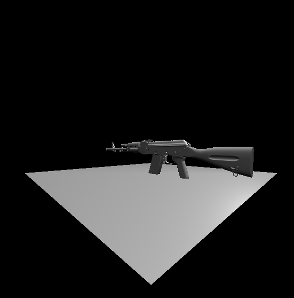
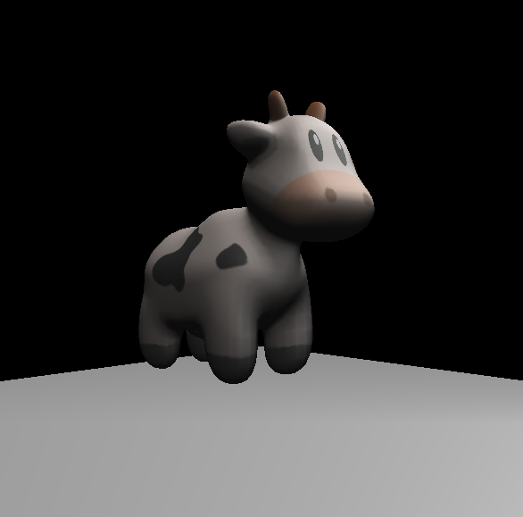

# AYR
AYR Renderer

## 效果：

目前未添加阴影：

## 已知bug：

相机靠近原点时，地板的渲染会出问题，可能是因为顶点在视锥外，经过projection后数值会不稳定。可能需要添加视锥裁剪功能。

## 已实现的功能:

- 线代计算库
- 绘制线、三角形
- MVP变换
- 纹理映射
- fragment shader结合点光源

## TODO：

- vertex shader
- shadow map
- 平行光

## 依赖库

- OBJ_Loader （games101里用的这个，非常难用，以后会换）
- stb

>  两个都是header-only library

## 构建项目解决方案

使用premake构建，目前只支持windows，但理论上可以实现跨平台。

AYR项目是软光栅核心部分，封装成动态库（win下是dll），链接到Outputer。

Outputer是输出项目，可以与平台有关。
